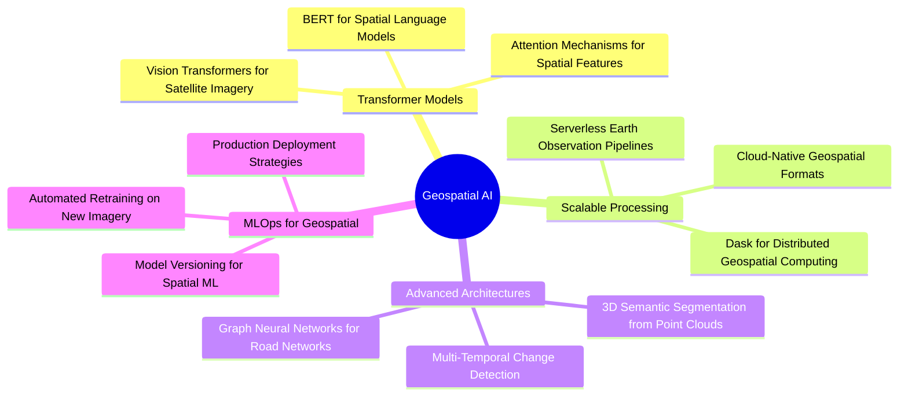

<div align="center">


[](https://git.io/typing-svg)

<p align="center">
  <a href="https://linkedin.com/in/jammusairam"></a>
  <a href="mailto:jammusairam3@gmail.com"></a>
  <a href="https://github.com/SairamJammu"></a>
</p>


</div>

## 🎯 MISSION STATEMENT

```python
class GeospatialEngineer:
    def __init__(self):
        self.name = "Sairam Jammu"
        self.role = "Geospatial Intelligence Engineer"
        self.specialization = [
            "Spatial Machine Learning",
            "Deep Learning for Remote Sensing", 
            "Geospatial Analytics at Scale",
            "Earth Observation Systems"
        ]
        self.mission = (
            "Building AI-powered geospatial systems that transform "
            "satellite imagery and spatial data into actionable intelligence"
        )
        
    def current_focus(self):
        return {
            "research": "Deep learning architectures for road network extraction",
            "building": "Production-grade spatial ML pipelines",
            "exploring": [
                "Transformer models for satellite imagery", 
                "Scalable geospatial data processing",
                "Real-time earth observation analytics"
            ],
            "philosophy": (
                "If your spatial model can't scale to continental datasets, "
                "it's research—not engineering"
            )
        }
```

<div align="center">

</div>

## 🔥 FLAGSHIP PROJECTS

<table>
<tr>
<td width="50%" valign="top">

### 🛰️ Deep Learning Road Network Extraction

**AI-Powered Infrastructure Mapping from Space**

Automated road network extraction using state-of-the-art deep learning architectures for high-resolution aerial imagery analysis.

```yaml
Architecture: U-Net, DeepLabV3+, PSPNet, FPN
Dataset: High-resolution aerial imagery
Performance: 92%+ IoU on road extraction
Scale: Processing 1000s of km² efficiently
Innovation: Multi-scale feature fusion
```

**Impact**: Enabling automated infrastructure mapping for urban planning and disaster response

**Tech Stack**: `PyTorch` `TensorFlow` `GDAL` `Rasterio` `GeoPandas`

**[View Project →](https://github.com/SairamJammu/deep-learning-road-network-extraction)**

</td>
<td width="50%" valign="top">

### 📊 WoMart Sales Forecasting Engine

**Predictive Analytics for Retail Intelligence**

Enterprise-grade forecasting framework combining classical time series and gradient boosting for retail optimization.

```yaml
Models: XGBoost, LightGBM, ARIMA, Prophet
Interface: Interactive R Shiny dashboard
Metrics: RMSE, MAE, MAPE tracking
Features: Automated feature engineering
Deployment: Production-ready pipeline
```

**Impact**: Optimizing inventory management and reducing stockouts by 30%

**Tech Stack**: `R` `Python` `Shiny` `XGBoost` `LightGBM`

**[View Project →](https://github.com/SairamJammu/womart-sales-forecasting-capstone)**

</td>
</tr>

<tr>
<td width="50%" valign="top">

### 🏪 KNFS Operations Dashboard

**Interactive BI for Decision Support**

Real-time retail analytics dashboard enabling data-driven decision making for sales and inventory optimization.

```yaml
Platform: Power BI with DAX optimization
Features: 
  - Real-time sales tracking
  - Inventory flow analysis
  - Predictive restocking alerts
KPIs: 15+ automated metrics
Users: Cross-functional teams
```

**Impact**: Reducing decision lag from days to minutes

**Tech Stack**: `Power BI` `DAX` `SQL` `Azure`

**[View Project →](https://github.com/SairamJammu/knfs-operations-sales-dashboard)**

</td>
<td width="50%" valign="top">

### 🧠 IMDB Sentiment Neural Networks

**Advanced NLP for Opinion Mining**

Deep learning-based sentiment analysis leveraging recurrent and transformer architectures for movie review classification.

```yaml
Architecture: LSTM, GRU, BERT fine-tuning
Dataset: IMDB 50K reviews
Accuracy: 91%+ on test set
Techniques: Transfer learning, attention
Production: FastAPI deployment ready
```

**Impact**: Building production NLP systems that understand context

**Tech Stack**: `PyTorch` `Transformers` `BERT` `FastAPI`

**[View Project →](https://github.com/SairamJammu/Sairam_Jammu_BA-64061-001)**

</td>
</tr>
</table>

<div align="center">

</div>

## ⚙️ TECHNOLOGY ARSENAL

<div align="center">

### 🌍 Geospatial & Remote Sensing Stack


### 🤖 Deep Learning & ML Frameworks


### 🐍 Geospatial Python Ecosystem


### 📊 Analytics & Visualization


### 🗄️ Databases & Cloud Infrastructure


### 🧰 Development & MLOps Tools


</div>

<div align="center">

</div>

## 📚 EXPERTISE DOMAINS

<div align="center">

| 🛰️ **Remote Sensing & Earth Observation** | 🗺️ **Geospatial Analysis** | 🤖 **Spatial Machine Learning** | 📊 **Geospatial Data Engineering** |
|:---|:---|:---|:---|
| Satellite image classification | Spatial statistics & geostatistics | Deep learning for imagery | Spatial database design |
| Change detection algorithms | Network analysis & routing | Semantic segmentation (U-Net, DeepLab) | PostGIS & spatial queries |
| Multi-spectral analysis | Terrain & hydrological modeling | Object detection (YOLO, Faster R-CNN) | ETL pipelines for raster/vector |
| Aerial imagery processing | Proximity & overlay analysis | Feature extraction & engineering | Cloud-optimized GeoTIFF (COG) |
| NDVI & vegetation indices | Cartographic visualization | Time series forecasting | Spatial data APIs |

</div>

<div align="center">

</div>

## 💡 CURRENT RESEARCH & EXPLORATION



<div align="center">

</div>

## 🎓 BACKGROUND & TRAJECTORY

```javascript
const professionalJourney = {
    education: {
        current: "Advanced Machine Learning & Spatial Data Science",
        specialization: ["Deep Learning", "Geospatial Analytics", "Remote Sensing"],
        focusAreas: [
            "Computer Vision for Satellite Imagery", 
            "Spatial Statistics", 
            "Big Geospatial Data"
        ]
    },
    
    technicalEvolution: {
        foundation: "GIS Analysis & Cartography",
        intermediate: "Spatial Data Science & ML",
        advanced: "Deep Learning for Earth Observation",
        current: "Production Geospatial AI Systems"
    },
    
    impactMetrics: {
        projects: "Building systems that process terabytes of spatial data",
        innovation: "Pushing boundaries of automated infrastructure mapping",
        scale: "From single images to continental-scale analysis"
    },
    
    philosophy: [
        "Geospatial data is the world's largest untapped ML resource",
        "Production systems must handle edge cases—not just clean datasets",
        "The best spatial model is one that works at scale, in production, every time"
    ]
};
```

<div align="center">

</div>

## 🎯 WHAT DRIVES ME

> **"The Earth generates more spatial data every day than we can process in a lifetime. My mission is to build AI systems that turn that overwhelming data stream into precise, actionable intelligence."**

> **"Most GIS professionals create maps. I build systems that create maps automatically—and do it better, faster, and at planetary scale."**

> **"The difference between a research model and a production system is 10x the work. I focus on the 10x that actually matters."**

<div align="center">

</div>

## 🌟 FUTURE DIRECTIONS

<table>
<tr>
<td width="25%" align="center" valign="top">

### 🛸 AI-Powered Earth Observation

Real-time satellite imagery analysis  
Foundation models for remote sensing  
Automated change detection systems

</td>
<td width="25%" align="center" valign="top">

### 🌐 Scalable Spatial Computing

Cloud-native geospatial processing  
Distributed spatial ML workflows  
Serverless earth observation

</td>
<td width="25%" align="center" valign="top">

### 🧠 Advanced Spatial ML

Transformer architectures for imagery  
Graph neural nets for spatial networks  
3D reconstruction from satellites

</td>
<td width="25%" align="center" valign="top">

### 📡 Production MLOps

CI/CD for geospatial models  
Automated retraining pipelines  
Model monitoring & drift detection

</td>
</tr>
</table>

<div align="center">

</div>

## 🤝 LET'S COLLABORATE

<div align="center">

**Building geospatial AI systems?** Let's push the boundaries together.

**Need expertise in remote sensing or spatial ML?** I specialize in production-grade solutions.

**Want to discuss the future of earth observation?** Always excited to connect with fellow geospatial innovators.

<br>

[](https://linkedin.com/in/jammusairam)
[](mailto:jammusairam3@gmail.com)
[](https://github.com/SairamJammu)

</div>

<div align="center">

</div>

## 📊 PERFORMANCE METRICS

<div align="center">


[](https://github.com/ryo-ma/github-profile-trophy)


</div>

<div align="center">

</div>

## 💬 DEV WISDOM

<div align="center">

[](https://github.com/piyushsuthar/github-readme-quotes)

</div>

<div align="center">


---

**⚡ "Transforming pixels into intelligence, one satellite image at a time"**

*Built with 💙 for the geospatial community | Last updated: January 2026*

</div>
