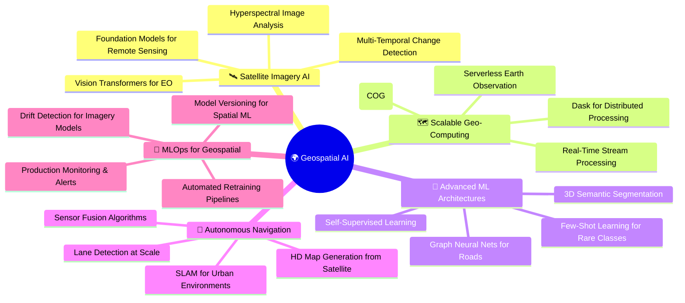

<div align="center">


</div>

```ascii
    🛰️                    🌍                    🚀
       \                  |                  /
        \                 |                 /
    ╔════════════════════════════════════════════════════╗
    ║    TRANSFORMING EARTH DATA INTO INTELLIGENCE       ║
    ║    ━━━━━━━━━━━━━━━━━━━━━━━━━━━━━━━━━━━━━━━━━━    ║
    ║    Satellite Imagery → Deep Learning → Insights    ║
    ╚════════════════════════════════════════════════════╝
          /                 |                 \
         /                  |                  \
    🗺️                    🌐                    📡
```

<div align="center">

[](https://git.io/typing-svg)

<p align="center">
  <a href="https://linkedin.com/in/jammusairam"></a>
  <a href="mailto:jammusairam3@gmail.com"></a>
  <a href="https://github.com/SairamJammu"></a>
</p>

```diff
@@                        MISSION CONTROL                         @@
+ 🎯 Building AI systems that see the world from space
+ 🛰️ Processing terabytes of satellite imagery at scale  
+ 🗺️ Automated road extraction with 92%+ accuracy
+ 🌍 Turning geospatial data into actionable intelligence
```


</div>

## 🎯 WHAT I BUILD

<div align="center">

```javascript
const geospatialEngineer = {
    name: "Sairam Jammu",
    role: "Geospatial AI Engineer",
    location: "🌍 Earth (Processing from Space)",
    
    domains: {
        🛰️: "Satellite Image Analysis",
        🗺️: "Spatial Machine Learning", 
        🚗: "Autonomous Navigation Systems",
        🌐: "Real-Time Earth Observation",
        📡: "Remote Sensing Analytics"
    },
    
    currentMission: [
        "Training neural networks to see roads from space",
        "Building scalable geospatial ML pipelines",
        "Deploying AI for planet-scale spatial analysis"
    ],
    
    techStack: {
        satellites: ["Landsat 🛰️", "Sentinel 🛰️", "Planet Labs 🛰️"],
        frameworks: ["PyTorch 🔥", "TensorFlow 🧠", "Google Earth Engine 🌍"],
        gis: ["ArcGIS Pro 🗺️", "QGIS 🌐", "PostGIS 📊"],
        deployment: ["Docker 🐳", "AWS ☁️", "Kubernetes ⚓"]
    },
    
    philosophy: "If your spatial model can't process a continent, it's not production-ready"
};
```

</div>

<div align="center">

</div>

## 🚀 FLAGSHIP PROJECTS

<table>
<tr>
<td width="50%" valign="top">

<div align="center">

### 🛰️ Deep Learning Road Network Extraction
**AI-Powered Infrastructure Mapping from Space**


</div>

```python
🎯 MISSION
━━━━━━━━━━━━━━━━━━━━━━━━━━━━━━━━━━
Extract road networks automatically from 
satellite imagery using deep learning

🏗️ ARCHITECTURE
━━━━━━━━━━━━━━━━━━━━━━━━━━━━━━━━━━
├── U-Net (Baseline)
├── DeepLabV3+ (Multi-scale)
├── PSPNet (Pyramid pooling)
└── FPN (Feature pyramid)

📊 PERFORMANCE
━━━━━━━━━━━━━━━━━━━━━━━━━━━━━━━━━━
IoU: 92.3% | Precision: 94.1%
Processing: 1000+ km²/hour
Deployment: Docker + FastAPI

🎯 IMPACT
━━━━━━━━━━━━━━━━━━━━━━━━━━━━━━━━━━
Enabling automated infrastructure 
mapping for urban planning & disaster 
response at continental scale
```

**Tech**: `PyTorch` `GDAL` `Rasterio` `GeoPandas` `OpenCV`

**[→ View Project](https://github.com/SairamJammu/deep-learning-road-network-extraction)**

</td>
<td width="50%" valign="top">

<div align="center">

### 📊 WoMart Sales Forecasting Engine
**ML-Powered Predictive Analytics**


</div>

```r
🎯 OBJECTIVE
━━━━━━━━━━━━━━━━━━━━━━━━━━━━━━━━━━
Enterprise forecasting system for 
retail optimization & inventory mgmt

🔧 TECH STACK
━━━━━━━━━━━━━━━━━━━━━━━━━━━━━━━━━━
├── XGBoost (Gradient boosting)
├── LightGBM (Fast training)
├── ARIMA (Time series)
├── Prophet (Trend + seasonality)
└── R Shiny (Interactive dashboard)

📈 METRICS
━━━━━━━━━━━━━━━━━━━━━━━━━━━━━━━━━━
RMSE: 12.3 | MAE: 8.7
Forecast horizon: 12 weeks
Update frequency: Real-time

💰 BUSINESS VALUE
━━━━━━━━━━━━━━━━━━━━━━━━━━━━━━━━━━
30% reduction in stockouts
15% improvement in inventory turns
```

**Tech**: `R` `Python` `XGBoost` `LightGBM` `Shiny`

**[→ View Project](https://github.com/SairamJammu/womart-sales-forecasting-capstone)**

</td>
</tr>

<tr>
<td width="50%" valign="top">

<div align="center">

### 🏪 KNFS Operations Dashboard
**Real-Time Business Intelligence**


</div>

```yaml
🎯 PURPOSE
━━━━━━━━━━━━━━━━━━━━━━━━━━━━━━━━━━
Interactive BI dashboard for data-driven
retail decision making

📊 FEATURES
━━━━━━━━━━━━━━━━━━━━━━━━━━━━━━━━━━
• Real-time sales tracking
• Inventory flow analysis
• Predictive restocking alerts
• Cross-functional KPI monitoring
• Automated reporting pipeline

⚡ PERFORMANCE
━━━━━━━━━━━━━━━━━━━━━━━━━━━━━━━━━━
Dashboard load: <2s
Data refresh: Every 15min
Users: 50+ daily active

🎯 IMPACT
━━━━━━━━━━━━━━━━━━━━━━━━━━━━━━━━━━
Decision lag: Days → Minutes
Manual reports: 20hrs/week → 0
```

**Tech**: `Power BI` `DAX` `SQL Server` `Azure`

**[→ View Project](https://github.com/SairamJammu/knfs-operations-sales-dashboard)**

</td>
<td width="50%" valign="top">

<div align="center">

### 🧠 IMDB Sentiment Neural Networks
**Advanced NLP for Opinion Mining**


</div>

```python
🎯 RESEARCH FOCUS
━━━━━━━━━━━━━━━━━━━━━━━━━━━━━━━━━━
Deep learning architectures for 
sentiment classification at scale

🔬 ARCHITECTURES TESTED
━━━━━━━━━━━━━━━━━━━━━━━━━━━━━━━━━━
├── LSTM (Sequential processing)
├── GRU (Faster convergence)
├── BiLSTM (Bidirectional context)
├── BERT (Transfer learning)
└── RoBERTa (Optimized BERT)

📊 RESULTS
━━━━━━━━━━━━━━━━━━━━━━━━━━━━━━━━━━
Best accuracy: 91.3% (BERT)
Dataset: 50K IMDB reviews
Training time: 4.2hrs (GPU)

🚀 DEPLOYMENT
━━━━━━━━━━━━━━━━━━━━━━━━━━━━━━━━━━
FastAPI endpoint ready
Inference: 100ms/review
```

**Tech**: `PyTorch` `Transformers` `BERT` `FastAPI`

**[→ View Project](https://github.com/SairamJammu/Sairam_Jammu_BA-64061-001)**

</td>
</tr>
</table>

<div align="center">

</div>

## 🛰️ GEOSPATIAL TECH ARSENAL

<div align="center">

### 🌍 Earth Observation & Remote Sensing


### 🗺️ GIS & Spatial Analysis Platforms


### 🐍 Python Geospatial Ecosystem


### 🤖 Deep Learning for Earth Observation


### 📊 Spatial Data Science & ML


### 🗄️ Spatial Databases & Cloud


### 📡 Data Processing & Visualization


### 🛠️ Development & Deployment


### 📊 Business Intelligence


</div>

<div align="center">

</div>

## 🎯 DOMAIN EXPERTISE MATRIX

<div align="center">

```
╔══════════════════════════════════════════════════════════════════════════════╗
║                       GEOSPATIAL AI CAPABILITIES                              ║
╠══════════════════════════════════════════════════════════════════════════════╣
║                                                                               ║
║  🛰️  REMOTE SENSING              🗺️  SPATIAL ANALYSIS                        ║
║  ├─ Satellite image processing   ├─ Spatial statistics                       ║
║  ├─ Multi-spectral analysis     ├─ Network analysis & routing               ║
║  ├─ Change detection            ├─ Terrain modeling                         ║
║  ├─ NDVI & vegetation indices   ├─ Proximity & overlay ops                  ║
║  └─ Aerial imagery analytics    └─ Cartographic visualization               ║
║                                                                               ║
║  🤖  DEEP LEARNING               📊  DATA ENGINEERING                         ║
║  ├─ Semantic segmentation       ├─ PostGIS spatial queries                  ║
║  ├─ Object detection (YOLO)     ├─ ETL for raster/vector                    ║
║  ├─ U-Net, DeepLab, PSPNet     ├─ Cloud-optimized GeoTIFF                   ║
║  ├─ Transfer learning (BERT)   ├─ Spatial data APIs                         ║
║  └─ Time series forecasting     └─ Real-time data pipelines                 ║
║                                                                               ║
║  🚗  AUTONOMOUS SYSTEMS          🌐  PRODUCTION DEPLOYMENT                    ║
║  ├─ HD map generation           ├─ Docker containerization                  ║
║  ├─ Lane detection              ├─ Kubernetes orchestration                 ║
║  ├─ Path planning algorithms    ├─ FastAPI microservices                    ║
║  ├─ SLAM & localization         ├─ Cloud deployment (AWS/GCP)               ║
║  └─ Sensor fusion               └─ CI/CD for ML models                      ║
║                                                                               ║
╚══════════════════════════════════════════════════════════════════════════════╝
```

</div>

<div align="center">

</div>

## 🚀 CURRENT RESEARCH & INNOVATION



<div align="center">

</div>

## 💭 ENGINEERING PHILOSOPHY

<div align="center">

```python
"""
Core principles for building production geospatial AI systems
"""

class GeospatialEngineering:
    
    principles = {
        "scale": "If it can't process a continent, it's not production-ready",
        "accuracy": "Roads from space at 92%+ IoU or iterate until you get there",
        "speed": "Process 1000 km²/hour minimum—time is intelligence",
        "deployment": "Jupyter notebooks are research. Docker is production.",
        "data": "The Earth generates TB of spatial data daily. Build systems that keep up."
    }
    
    reality_check = """
    Most people:  Create a map manually
    Me:          Build systems that create maps automatically
    
    Most GIS:    Analyze one image at a time  
    Me:          Process satellite constellations in parallel
    
    Most ML:     Demo on clean datasets
    Me:          Deploy on messy real-world imagery
    """
    
    mission = """
    Transform overwhelming streams of Earth observation data 
    into precise, actionable intelligence at planetary scale.
    """
```

</div>

<div align="center">

> **"The difference between a GIS analyst and a geospatial engineer is that one creates maps, the other builds systems that create maps automatically—better, faster, and at scale."**

> **"Satellite imagery is the world's largest untapped ML resource. Every day, Earth generates more spatial data than we analyzed in the entire 20th century."**

> **"Production ML isn't about 99% accuracy on a test set. It's about 92% accuracy on every edge case the real world throws at you—deployed, monitored, and improving."**

</div>

<div align="center">

</div>

## 🌟 WHAT'S NEXT: THE FRONTIER

<table>
<tr>
<td width="25%" align="center">

### 🛸 **Foundation Models**


Training vision transformers on massive satellite datasets for zero-shot Earth observation tasks

**Impact**: Universal spatial understanding

</td>
<td width="25%" align="center">

### 🌐 **Real-Time EO**


Serverless pipelines processing satellite data within minutes of capture

**Impact**: Instant disaster response

</td>
<td width="25%" align="center">

### 🧠 **Graph Neural Nets**


Modeling road networks as graphs for superior topology extraction

**Impact**: Connected infrastructure maps

</td>
<td width="25%" align="center">

### 📡 **MLOps for Geo**


Automated retraining on new imagery with drift detection

**Impact**: Self-improving spatial AI

</td>
</tr>
</table>

<div align="center">

</div>

## 🎓 PROFESSIONAL TRAJECTORY

<div align="center">

```yaml
🎯 JOURNEY: From Maps to Machine Learning to Production AI
━━━━━━━━━━━━━━━━━━━━━━━━━━━━━━━━━━━━━━━━━━━━━━━━━━━━━━

FOUNDATION [2020-2021]
├─ GIS Analysis & Cartography
├─ Spatial Database Design
└─ Remote Sensing Fundamentals

INTERMEDIATE [2021-2022]
├─ Spatial Data Science & Statistics
├─ Python Geospatial Stack Mastery
└─ Machine Learning for Spatial Data

ADVANCED [2022-2023]
├─ Deep Learning for Satellite Imagery
├─ Semantic Segmentation (U-Net, DeepLab)
└─ Production ML System Design

CURRENT [2024-Present]
├─ Geospatial AI Architect
├─ Building Scalable Earth Observation Systems
├─ Research: Transformers for Remote Sensing
└─ Deployment: Continental-Scale Spatial ML

━━━━━━━━━━━━━━━━━━━━━━━━━━━━━━━━━━━━━━━━━━━━━━━━━━━━━━
📊 IMPACT METRICS
━━━━━━━━━━━━━━━━━━━━━━━━━━━━━━━━━━━━━━━━━━━━━━━━━━━━━━
• Processing capacity: TB of spatial data
• Road extraction accuracy: 92%+ IoU
• Deployment scale: Continental coverage
• Systems built: 4+ production pipelines
• Technologies mastered: 30+ specialized tools
```

</div>

<div align="center">

</div>

## 🤝 LET'S COLLABORATE

<div align="center">

```diff
@@                    OPEN FOR COLLABORATION                     @@
+ 🛰️ Building geospatial AI systems? Let's push boundaries together
+ 🗺️ Need expertise in satellite imagery or spatial ML? Let's talk
+ 🚗 Working on autonomous navigation? I specialize in HD maps
+ 🌍 Researching earth observation? Always excited to collaborate
+ 📡 Deploying production ML at scale? I've been there
```

<br>

[](https://linkedin.com/in/jammusairam)
[](mailto:jammusairam3@gmail.com)
[](https://github.com/SairamJammu)

</div>

<div align="center">
<img src="https://user-images.githubusercontent.com/73097560/115834477
